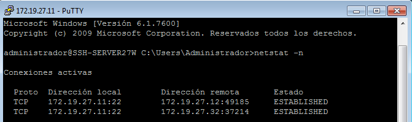

# U1-A2 ACCESO REMOTO SSH

## 2.2 Primera conexión SSH desde cliente GNU/Linux
* Nmap al servidor

* Primera conexión

* Segunda conexión

## 3.2 Comprobamos cambio de la identidad del servidor
* OpenSUSE

Vemos que nos aparece una advertencia porque ha cambiado la identidad del servidor. Para solucionarlo ejecutamos el siguiente comando:

* Windows

## 5 Autenticación mediante claves públicas

Añadir clave openSUSE

Acceso sin poner contraseña

Desde windows

## 6 Uso del SSH como túnel para x

Para poder acceder al servidor por ssh para usar una aplicación tenemos que descomentar la opción *X11Forwarding yes* que se encuentra en el fichero de configuración *sshd_config*.

Comprobamos que geany no está instalado en cliente.

Accedemos al servidor por ssh con el argumento -x para poder usar aplicaciones gráficas que se encuentran en el servidor.

## 8.1 Restricción sobre un usuario

Para restringir el acceso a un usuario debemos añadir una línea en el documento *sshd_config*.

Probamos a entrar desde el cliente openSUSE y observamos que prohibe el acceso:

## 9 Servidor SSH en windows

Creamos una máquina con Windows Server 2008 y ejecutamos el comando que aparece a continuación para instalar el servidor ssh:

``Set-ExecutionPolicy Bypass -Scope Process -Force; iex ((New-Object System.Net.WebClient).DownloadString('https://raw.githubusercontent.com/teuton-software/teuton/master/bin/windows_s-node_install.ps1'))``

Tras estar instalado accedemos desde el cliente windows y el cliente openSUSE e introducimos el comando ``netstat -n`` para ver las conexiones activas en el servidor.

