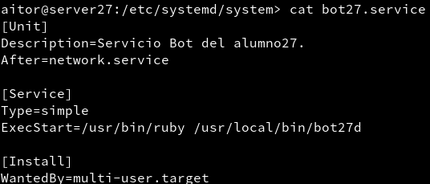
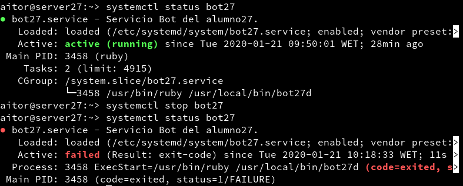
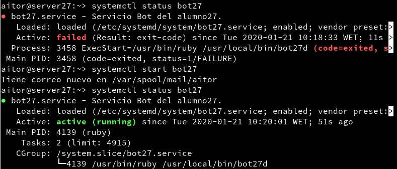
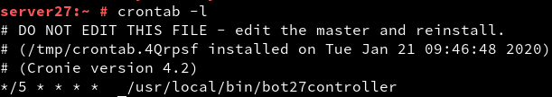

# U2-A1 BOT SERVICE

## 1.4 Entrega

Script del bot: https://github.com/arrod27/add1920-aitor/blob/master/u5/a2/bot-demo.rb

URL del video: https://www.youtube.com/watch?v=i2ATXLM4Kc0

## 2.4 Entrega

Fichero de configuración del servicio: 

Parar el servicio:

Arrancar el servicio:

## 3.2 Tareas programadas

Configuración de crontab:

