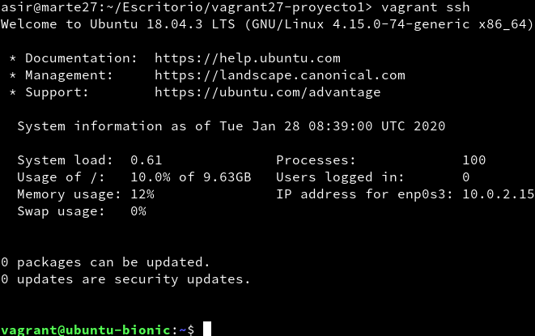
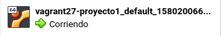
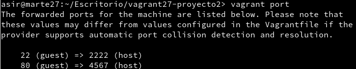
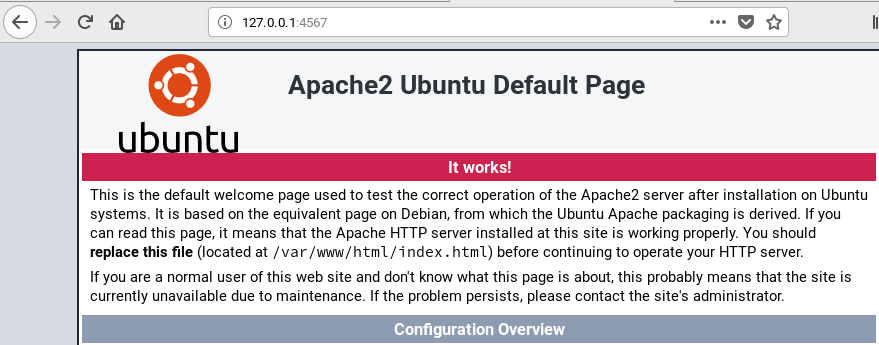
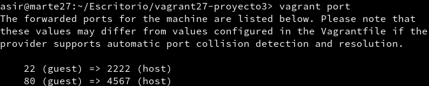
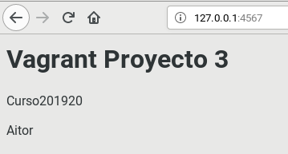
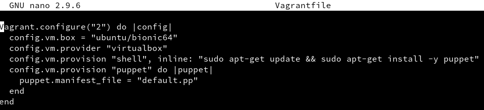
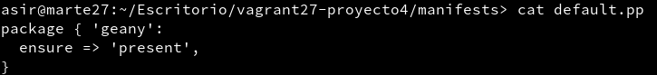
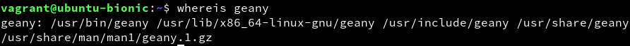
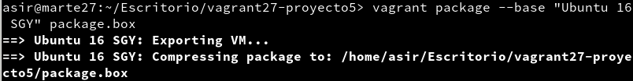

# U6-A1 Vagrant

## 3.1 Comprobar proyecto 1

Conectar por ssh:

Máquina en VirtualBox:

## 5.2 Comprobar proyecto 2

Redireccionamiento de puertos:

Comprobación:

## 6.1 Proyecto 3 (Suministro mediante shell Script)

Redireccionamiento de puertos:

Comprobación:

## 6.2 Proyecto 4 (Suministro mediante Puppet)

Contenido Vagrantfile:

Contenido default.pp:

Geany instalado:

## 7.2 Crear caja Vagrant

Exportar la máquina:

Caja creada:

