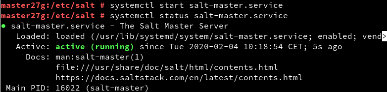
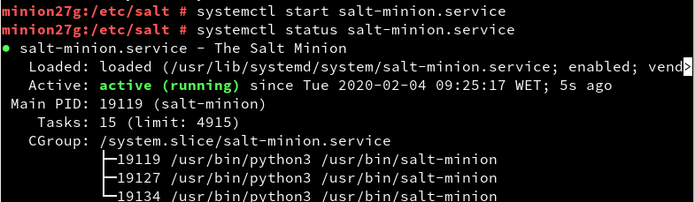
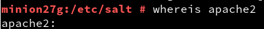
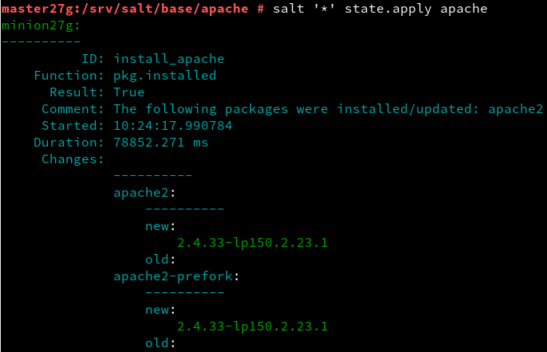
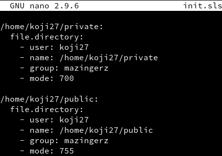

# U6-A2 Salt-stack

## 2. Preparativos

Tanto en la máquina máster como en la máquina minion  añadimos en */etc/hosts* la asociación de nombres e IPs de ambas máquinas.

## 3. Master: instalar y configurar

En la máquina máster instalamos el software del máster de salt-stack:

Una vez instalado, vamos a */etc/salt* y modificamos un archivo llamado "master", en el que debemos introducir la información que aparece a continuación:

Luego activamos el servicio y lo iniciamos:

Si comprobamos los minions que están activos, podemos ver que todavía no hay ninguno:

## 4. Minion

### 4.1 Instalación y configuración

Comenzamos instalando el software del minion:

Al igual que con el master, tenemos que modificar el archivo "minion", que se encuentra en */etc/salt* añadiendo la información que aparece en la siguiente imagen.

También tendremos que activar e iniciar el servicio:

Por último, comprobamos que apache no se encuentra instalado:

### 4.2 Aceptación desde el master

Para que el master pueda aceptar las peticiones, debemos tener abiertos los puertos 4505 y 4506. En esta práctica lo que haremos será deshabilitar el cortafuegos por completo.

Tras esto, volvemos a comprobar las peticiones que recibe el master y podemos observar que en peticiones no aceptadas aparece el minion.

Lo aceptamos y comprobamos que ahora nos aparece en peticiones aceptadas:

Comprobamos mediante comandos de salt que tenemos comunicación con el minion.

### 4.4 Comprobamos conectividad

## 5 Salt states

### 5.1 Preparar el directorio para los estados

En la misma máquina máster creamos dos carpetas para poder guardar los estados de salt. Esto lo haremos en la ruta */srv/salt*.

Editamos el fichero que aparece en la imagen a continuación:

Reiniciamos el servicio para que se apliquen los cambios

### 5.2 Crear nuevo estado

Vamos a crear un fichero que contenga el estado de salt que instale apache.

### 5.3 Asociar Minions a estados

Crearemos un archivo en */srv/salt/base* llamado "top.sls" donde asociaremos todos los estados. Como sólo hemos creado uno, lo añadimos:

### 5.4 Comprobar estados definidos

Para comprobar que el estado que hemos creado, ejecutamos el siguiente comando:

### 5.5 Aplicar el nuevo estado

Consultamos los estados y vemos que no hay ningún error:

Procedemos entonces a lanzar el nuevo estado en el minion.

## 6. Crear más estados

### 6.1 Crear estado "users"

Continuaremos añadiendo un nuevo estado que cree usuarios y los añada a un grupo. Esto lo haremos añadiendo un nuevo directorio a */srv/salt/base* llamado "users"

Añadimos este estado en el fichero top:

Después de esto, aplicamos el estado:

### 6.2 Crear estado "directories"

Al igual que con los estados anteriores, creamos un archivo que contenga la configuración de este estado.

Aplicamos el estado:

## 7. Añadir minion de otro SO

Iremos a una ,máquina con windows 7 e instalaremos el software "salt-minion". Durante la instalación solicitará que introduzcamos la ip del servidor y el nombre del minion.

Volvemos a la máquina del máster y si listamos listamos los minions que se encuentran disponibles. Si nos fijamos en los que se encuentran rechazados, vemos el minion de windows que acabamos de configurar.

 

 Lo añadimos al máster y con esto habremos terminado.

 
