# U6-A3 Docker

## 2. Instalación y primeras pruebas

### 2.1 Habilitar el acceso a la red externa a los contenedores

Para que docker pueda tener acceso a la red externa, debemos activar la opción de redireccionamiento de interfaces. Esto lo comprobaremos viendo el valor que hay en el fichero *ip_forward* que se encuentra en la ruta */proc/sys/net/ipv4*.

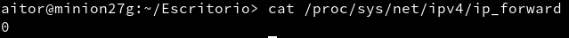

Vemos que aparece un 0, lo que indica que no está activado. Modificamos el valor y lo situamos a 1.

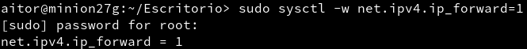

### 2.2 Instalación

Descargamos docker desde los repositorios.

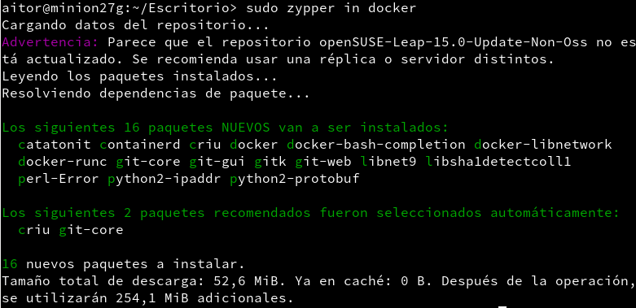

Ahora tendremos que activar el servicio para que funcione.

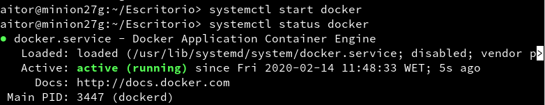

Por último, comprobamos la versión de docker que se ha instalado.

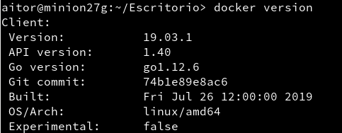

### 2.3 Primera prueba

Ejecutamos el comando *docker images*, y vemos que no aparece nada porque no hemos descargado ninguna imagen aún.

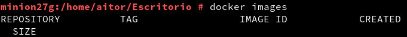

Ahora mostraremos todos los contenedores creados, y tampoco aparece ninguno.

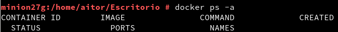

Como prueba, descargaremos el contenedor *hello-world*.

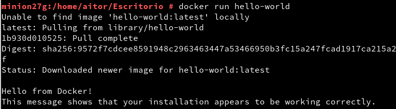

Si volvemos a ejecutar el comando *docker images* vemos que ahora aparece el contenedor que acabamos de descargar.

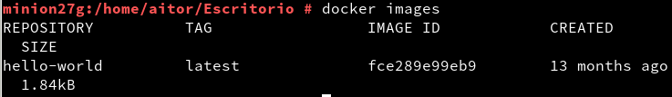

También ejecutaremos de nuevo el comando para mostrar todos los contenedores y efectivamente aparece el contenedor recién descargado.

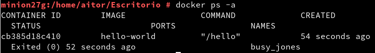

En el mismo comando anterior, podemos apreciar que al contenedor se le ha asignado un ID. Usaremos este identificador para detener el contenedor.

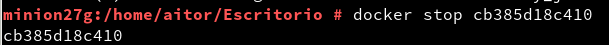

Como se trata de una prueba, lo eliminaremos usando el mismo identificador.

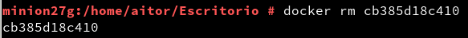

Por último, mostramos los contenedores, y esta vez vemos que no hay ninguno.

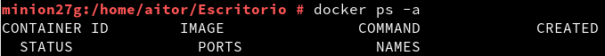

## 3. Creación manual de nuestra imagen

### 3.1 Crear un contenedor manualmente

Buscaremos en los repositorios de Docker Hub todos los contenedores que incluyan la palabra "debian" en su nombre.

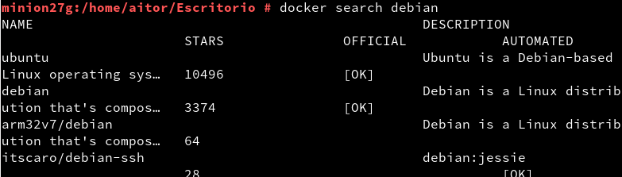

Vemos que hay multitud de contenedores que cumplen esta característica, así que descargaremos una de las imágenes.

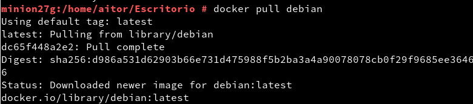

Mostramos las imágenes descargadas y vemos que aparece una de debian

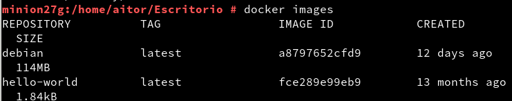

A continuación crearemos un contenedor con el nombre *con_debian* a partir de la imagen que acabaos de descargar. Además de esto, ejecutaremos el programa */bin/bash* dentro del contenedor.

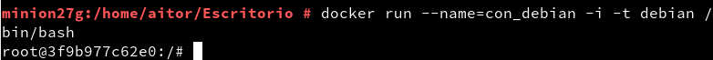

### 3.2 Personalizar el contenedor

Finalizamos el apartado anterior ejecutando la teminal bash dentro de nuestro contenedor, por lo que ahora estaremos dentro de este. Leemos el fichero */etc/motd* para comprobar que estamos dentro de un sistema debian.

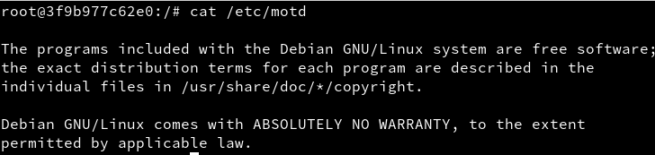

Actualizamos los paquetes que sean posibles.

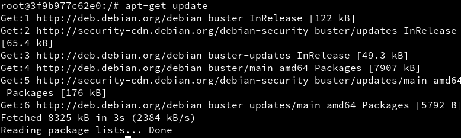

Ahora instalaremos *nginx* y el editor *nano* en el contenedor.

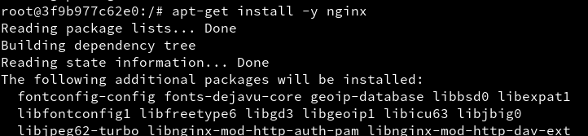

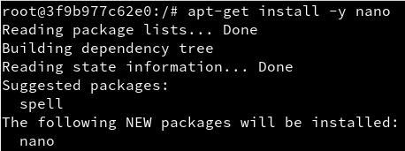

Posteriormente, crearemos un fichero *index.html* en el que pondremos nuestro nombre. Llamamos al archivo *index* para que en cuanto accedamos al sitio web aparezca esta página, y no tengamos que poner una ruta de acceso en el navegador.

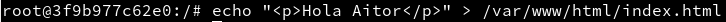

Después crearemos un script para que nginx se ejecute de manera continua en nuestro navegador.

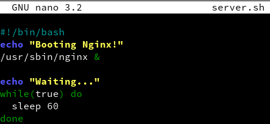

Puesto que es un script, le tendremos que dar permisos para que se pueda ejecutar en nuestra máquina. Le daremos todos los permisos para que no ocurra ningun problema con estos.

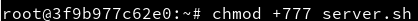

### 3.3 Crear una imagen a partir del contenedor

Con el apartado anterior habremos creado el contenedor. Ahora tenemos que crear una imagen a partir de ese contenedor. Esto lo haremos en otra ventana ejecutando el comando que aparece en la imagen a continuación.

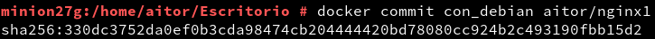

Si comprobamos las imágenes, aparece la que acabamos de crear a partir del contenedor.

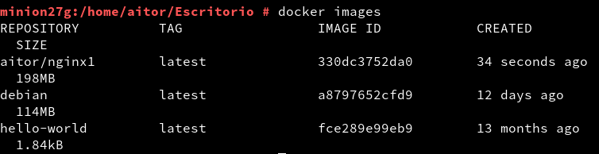

## 4. Crear contenedores a partir de nuestra imagen

###4.1 Crear contenedor con Nginx

Iniciamos el contenedor que creamos en el apartado anterior.

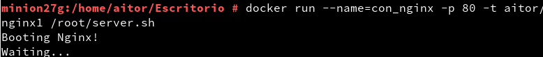

###4.2 Comprobamos

Ejecutamos el comando *docker ps* para ver los contenedores que se encuentran en ejecución en este momento. Vemos que aparece el creado anteriormente con nginx. Entre los detalles, podemos observar que hay una redirección de puertos. Esto es lo que usaremos para acceder a este contenedor.

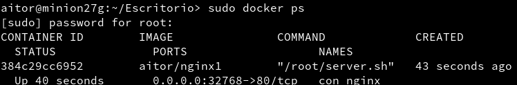

Accedemos pues desde un navegador a esta dirección, y vemos que aparece al mensaje que indicamos anteriormente

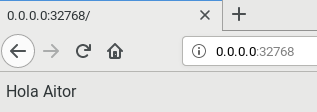

Como hicimos anteriormente, paramos y eliminamos el contenedor

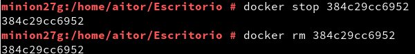

###4.3 Migrar la imagen a otra máquina

## 5. Dockerfile

### 5.1 Preparar ficheros

Para alojar los *dockerfiles*, crearemos una carpeta llamada *docker27a*.

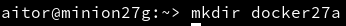

Dentro de esta carpeta, crearemos lo necesario para que funcione correctamente un contenedor.

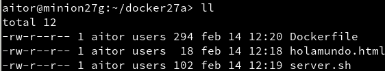

Además de lo anterior, crearemos un fichero llamado *Dockerfile* con el contenido que aparece en la imagen a continuación.

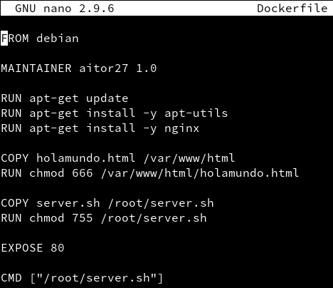

### 5.2 Crear imagen a partir del Dockerfile

Ejecutamos el siguiente comando para crear una nueva imagen.

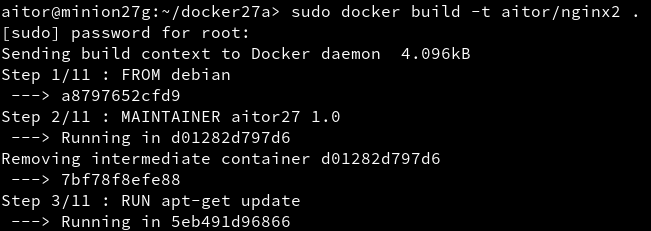

Vemos ahora todos las imágenes de docker que tenemos, y podemos observar que la primera es la que acabamos de crear a partir del dockerfile.

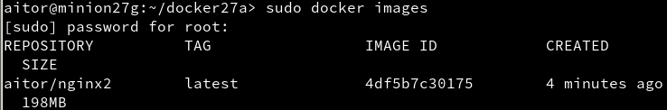

### 5.3 Crear contenedor y comprobar

Creamos un contenedor con nombre *con_nginx2* a partir de la imagen anterior.

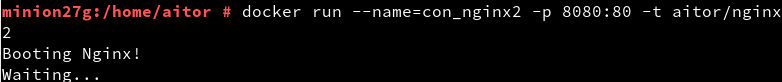

Ejecutamos otra terminal con el comando *docker ps* para averiguar el puerto que está a la escucha en este contenedor. Vemos que es el que le hemos asignado nosotros cuando creamos el contenedor.

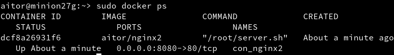

Vamos al navegador, y entramos con el puerto que nos aparece. Vemos que aparece la página principal de nginx.

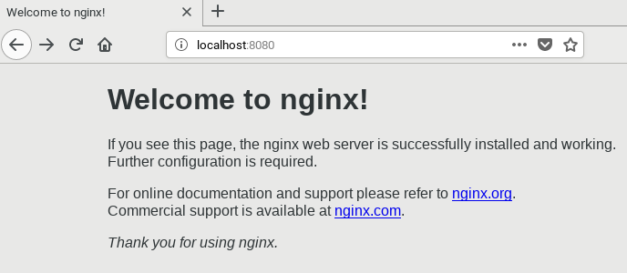

Si accedemos al archivo *holamundo* aparecerá el creado anteriormente que contiene nuestro nombre.

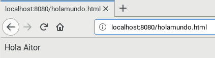

### 5.4 Usar imágenes ya creadas

